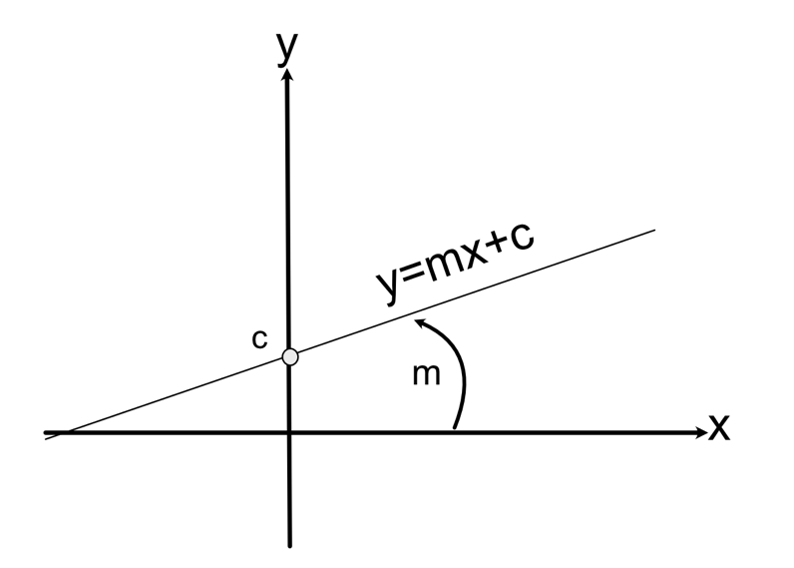
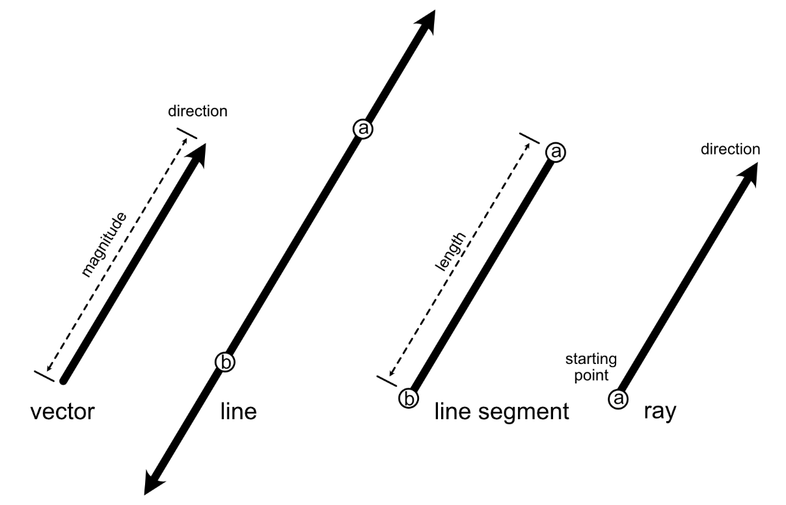
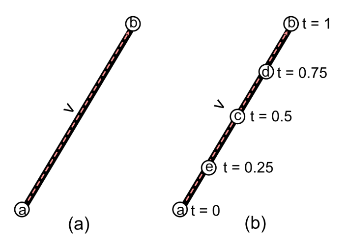
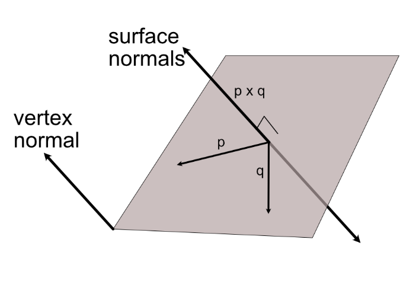
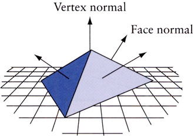
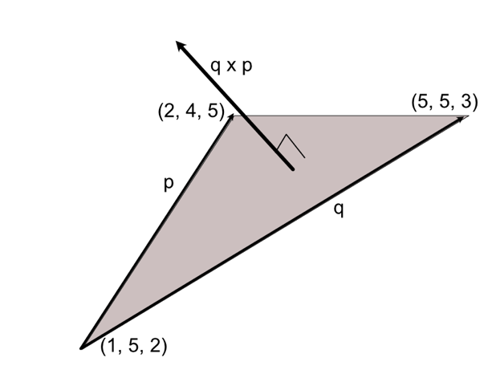

# Zapoznanie się z liniami, promieniami i wektorami normalnymi

W tym laboratorium poznamy podstawy matematyczne opisujące **linie proste**, **odcinki linii**, **promienie** oraz **wektory normalne** i ich zastosowanie w grafice komputerowej. Wszystkie te elementy można zdefiniować za pomocą wektorów i na pierwszy rzut oka wydają się podobne, jednak pełnią różne, specyficzne role w grafice. Ich wspólną cechą jest „liniowość” – wszystkie są **prostoliniowe**, co czyni je użytecznymi do definiowania przestrzeni, kierunków, krawędzi siatek (mesh), odległości, wykrywania kolizji, symulacji odbić światła i wielu innych zadań w grafice komputerowej. 

W ramach ćwiczenia zbudujemy odpowiednie struktury danych oraz funkcje w naszym projekcie, aby praktycznie zastosować te pojęcia. Najpierw dokładnie przeanalizujemy różnice między linią, odcinkiem, promieniem i wektorem normalnym oraz omówimy ich zastosowania. Następnie poznamy **parametryczną formę równania linii**, którą wykorzystamy do animowania ruchu obiektu (sześcianu) w przestrzeni 3D. Na koniec użyjemy zdobytych umiejętności rysowania linii do wyświetlenia wektorów normalnych powierzchni obiektu, co stanowi istotny element zrozumienia, jak powierzchnie są oświetlane i teksturowane w grafice 3D.

**Wymagania wstępne:** Kontynuujemy pracę z projektem z poprzednich zajęć. Zakładamy, że posiadasz środowisko Python (np. PyCharm) z zainstalowanymi bibliotekami **Pygame** i **PyOpenGL** oraz bazowy kod projektu z poprzedniego laboratorium (m.in. moduł `Vectors.py` z implementacją wektorów).

## Definiowanie linii, odcinków i promieni

Zanim przejdziemy do implementacji, ustalmy pojęcia teoretyczne. Często potocznie **„linią”** nazywamy coś, co w matematyce jest w rzeczywistości **odcinkiem**. **Odcinek** to skończony fragment linii prostej między dwoma punktami, podczas gdy **linia prosta** (w sensie matematycznym) jest obiektem ciągnącym się w obu kierunkach w nieskończoność. W grafice komputerowej rzadko operujemy idealnymi liniami prostymi (trudno liczyć coś aż do nieskończoności); zamiast tego zazwyczaj używamy odcinków, np. do rysowania krawędzi kształtów. Już w poprzednich ćwiczeniach (np. w części 2) użyliśmy klasycznego równania prostej do rysowania odcinków między kliknięciami myszy. Przypomnijmy to równanie prostej na płaszczyźnie XY:

$y = mx + c$,

gdzie $m$ oznacza **nachylenie (ang. slope)** prostej, a $c$ jest wartością **wyrazu wolnego (punkt przecięcia z osią Y)**. Parametry $m$ i $c$ jednoznacznie definiują linię prostą na płaszczyźnie (zobrazowano to na ilustracji 1). Wartości $y$ można teoretycznie obliczać dla dowolnych (nieskończonych) wartości $x$, przez co linia jest ciągła i nieskończona. W przypadku **odcinka** jednak istnieją punkty końcowe, które ograniczają zakres $x$ (i $y$) do pewnego przedziału. Innymi słowy, odcinek to część linii między dwoma punktami, jak pokazano na ilustracji 2.

  
*Ilustracja 1: Nachylenie (m) i punkt przecięcia z osią Y (c) dla prostej $y = mx + c$.* 

  
*Ilustracja 2: Różne rodzaje prostych geometrycznych: nieskończona linia prosta, odcinek (linia ograniczona punktami końcowymi) oraz promień (półprosta).* 

Aby lepiej zrozumieć różnice między tymi elementami prostoliniowymi, rozważmy ich właściwości:

- **Wektor** – posiada **magnitude** (długość) i **direction** (kierunek), ale **nie ma określonej lokalizacji w przestrzeni**. Wektora możemy użyć do reprezentowania przesunięć, prędkości, siły itp. W grafice wektory są wszechobecne: wykorzystujemy je do przemieszczania obiektów, pomiaru odległości, obliczania oświetlenia itp. (zapoznałeś się z nimi w poprzednim laboratorium). Wektor najczęściej wyobrażamy sobie jako strzałkę od punktu początkowego do końcowego, ale ten punkt początkowy jest umowny – identyczny wektor może być „przyłożony” w dowolne miejsce przestrzeni.

- **Linia prosta** – jest nieskończona w obu kierunkach. Można ją zdefiniować, podając dwa różne punkty, przez które ta linia przechodzi (te punkty wyznaczają jednoznacznie prostą w przestrzeni). Linia ma **lokację w przestrzeni** (przechodzi przez konkretne punkty), ale **nie ma punktów końcowych** – rozciąga się w nieskończoność. W praktyce grafiki komputerowej *czysta matematyczna linia* nie jest bezpośrednio rysowana, gdyż nie sposób wyświetlić czegoś nieskończenie długiego. Jednak równania prostych wykorzystujemy pośrednio, np. do obliczania odcinków leżących na tej linii (przydatne przy rysowaniu krawędzi, obliczaniu przecięć itp.).

- **Odcinek (linia odcinkowa)** – może być opisany tym samym równaniem co linia prosta, ale jest **skończonej długości**. Ma **początek i koniec**. Pisząc równanie odcinka, explicite uwzględniamy ograniczenie dziedziny do przedziału między współrzędnymi początkowego i końcowego punktu. Na przykład równanie prostej $y = mx + c$ opisuje odcinek tylko dla $x$ mieszczącego się pomiędzy $x_A$ oraz $x_B$ punktów końcowych A i B. Poza tym zakresem odcinek nie jest zdefiniowany (prosta biegnęłaby dalej, ale odcinek już się kończy). Mówiąc obrazowo: **odcinek = linia prosta ucięta z obu stron**. W grafice to właśnie odcinki są najczęściej wykorzystywane – każda narysowana segmentowa krawędź obiektu jest odcinkiem. Odcinki tworzą krawędzie wielokątów i siatek 3D.

- **Promień (półprosta)** – ma **punkt początkowy** oraz **kierunek**, i ciągnie się w nieskończoność tylko w **jednym** kierunku. Można go sobie wyobrazić jako wektor zaczepiony w konkretnym punkcie: startuje w tym punkcie i biegnie prosto przed siebie bez końca. W grafice promienie są wykorzystywane m.in. do reprezentowania wiązek światła (promienie świetlne) oraz do obliczeń kolizji (np. *ray tracing*, *ray casting* – wysyłanie promieni w scenie w celu wykrycia, co napotkają). Promień zdefiniujemy podając punkt początkowy oraz kierunek w postaci wektora (o dowolnej długości, bo istotny jest tylko kierunek).

Podsumowując: potocznie możemy używać słowa *linia* na określenie zarówno linii prostych, odcinków czy promieni – i często z kontekstu wiadomo o co chodzi. Jednak jako przyszli specjaliści od grafiki musimy rozumieć **precyzyjne definicje** i wiedzieć, kiedy mamy do czynienia z wektorem kierunku, linią nieskończoną, odcinkiem czy promieniem. W wielu obliczeniach graficznych elementy te występują wspólnie – np. odcinek ruchu gracza można przedłużyć do promienia, by wykryć kolizję, lub obliczyć jego parametry wektorami. Dlatego ważne jest zrozumienie **kontekstu**, w jakim operujemy tymi pojęciami, aby nie mylić np. punktów z wektorami czy odcinków z całymi liniami – inaczej działania matematyczne sprowadzają się tylko do dodawania/odejmowania współrzędnych bez zrozumienia, co reprezentują.

## Użycie formy parametrycznej linii

Choć klasyczne równanie prostej $y = mx + c$ jest nam dobrze znane z matematyki szkolnej, w grafice komputerowej nie jest ono zbyt wygodne do wielu zastosowań, takich jak animacje czy obliczanie punktów przecięcia. Zamiast tego częściej wykorzystujemy **formę parametryczną** opisu linii. W formie parametrycznej nie wyznaczamy zależności $y(x)$ wprost – zamiast zmiennej $x$ i $y$ wprowadzamy parametr (najczęściej oznaczany $t$), który reprezentuje **czas lub umowny postęp** wzdłuż linii. 

Jak to działa? Rozważmy odcinek linii między punktami **A** i **B**. Możemy zdefiniować **wektor** **$v$** łączący te dwa punkty:

$ \mathbf{v} = B - A. $

Punkt **B** można wtedy wyrazić jako:

$ B = A + \mathbf{v}. $

Znaczy to: **jeśli wystartujemy z punktu A i przejdziemy cały wektor $v$**, to dotrzemy do punktu B. Teraz zapytajmy: gdzie będziemy, jeśli przejdziemy tylko połowę drogi z A do B (połowę wektora $v$)? Taka sytuacja to:

$ C = A + 0,5\,\mathbf{v}, $

co oznacza, że punkt **C** leży w połowie odcinka AB (zobrazowano to na ilustracji 3). Gdybyśmy nie przeszli w ogóle wektora $v$ (mnożnik 0), pozostalibyśmy w punkcie A; gdy przejdziemy cały (mnożnik 1) – docieramy do B.

  
*Ilustracja 3: Odcinek między punktami A i B oraz wektor $v$ wskazujący z A do B. Punkt C to położenie w połowie odcinka (t = 0,5).* 

We wzorze $C = A + 0,5\,\mathbf{v}$ współczynnik *0,5* jest właśnie skalarem określającym **proporcję przebytej drogi** wzdłuż odcinka. Formuła parametryczna zastępuje ten skalar **zmienną** $t$, którą możemy interpretować jako upływ czasu lub ogólniej **parametr przebiegu odcinka**. Dla początku odcinka $A$ przyjmujemy $t = 0$, a dla końca $B$ – $t = 1$. Wówczas **parametryczne równanie odcinka** można zapisać jako:

$ P(t) = A + t\,\mathbf{v}, \quad 0 \leq t \leq 1, $

gdzie $P(t)$ oznacza dowolny punkt na odcinku w zależności od parametru $t$. 

* Uwaga: Zapis $P(t)$ jest ogólną postacią parametryczną. Często precyzujemy to na współrzędnych: $(x(t), y(t), z(t)) = (x_A, y_A, z_A) + t\,(v_x, v_y, v_z)$. Dla $t=0$ otrzymujemy $(x_A, y_A, z_A)$ (punkt A), dla $t=1$ – $(x_B, y_B, z_B)$ (punkt B), a dla wartości pośrednich – punkty leżące między A i B. 

Jeśli $t$ wyjdzie poza zakres [0,1], formuła nadal opisuje **linię prostą przechodzącą przez A i B**, a nie tylko odcinek. Dla $t < 0$ punkty leżą po „lewej” stronie A, a dla $t > 1$ – poza B. Dla pełnej nieskończonej linii można zapisać:

$ P(t) = A + t\,\mathbf{v}, \quad -\infty < t < \infty, $

przy czym wciąż dla $t=0$ mamy A, a dla $t=1$ punkt B. Widzimy zatem, że $t$ reprezentuje **procent przebycia drogi od A do B**, lub inaczej – umowny czas ruchu z A do B (0 to start, 1 to koniec). Dzięki parametryzacji możemy łatwo otrzymać dowolny punkt na odcinku (dla $0 \leq t \leq 1$) lub na prostej (dla dowolnego $t$). 

**Zastosowanie parametryzacji:** W grafice forma parametryczna jest szczególnie użyteczna przy:
- **Animacjach ruchu** – gdy chcemy przemieszczać obiekt z punktu A do B płynnie w czasie, wystarczy zwiększać parametr $t$ od 0 do 1 i ustawiać pozycję $P(t)$.
- **Interpolacji (Lerp)** – wyznaczaniu punktu pośredniego pomiędzy dwoma innymi w zadanej proporcji.
- **Obliczaniu kolizji i przecięć** – łatwiej jest wyrazić równanie prostej (lub promienia) parametrycznie i sprawdzać, dla jakiego $t$ następuje przecięcie z innym obiektem.
- **Rysowaniu** – generowaniu dyskretnych punktów linii na podstawie parametru.

Parametryzacja to potężne narzędzie: zamiast zależności $y(x)$ mamy jeden wzór wektorowy opisujący całą linię/odcinek w przestrzeni 2D lub 3D. W następnym ćwiczeniu wykorzystamy to do **animowania obiektu**.

## Animowanie pojedynczego sześcianu

W tym ćwiczeniu użyjemy **równania parametrycznego linii**, aby wprawić obiekt (sześcian) w ruch między dwoma punktami w przestrzeni 3D. Parametr $t$, interpretowany jako czas, będzie się zmieniał od 0 do 1 i wyznaczał położenie sześcianu na odcinku łączącym pozycję startową z końcową. Dzięki temu utrwalimy praktyczne użycie parametru $t$ do animacji.

**Kroki do wykonania:**

1. **Przygotowanie projektu:** Utwórz nowy folder zgodnie ze swoją strukturą. Skopiuj do niego **wszystkie pliki** z poprzedniego ćwiczenia, w tym moduł `Vectors.py` zawierający implementację wektorów oraz pozostałe pliki projektu. Upewnij się, że struktura katalogów i plików jest zachowana.

2. **Zmiana nazwy modułu:** Zduplikowany moduł `Vectors.py` z poprzedniego laboratorium będzie bazą do naszych modyfikacji. Zmień jego nazwę na `Animate.py`. Ten plik będzie teraz głównym modułem wykonywalnym, w którym zaimplementujemy animację.

3. **Modyfikacja kodu pod animację:** Otwórz plik `Animate.py` i zmodyfikuj jego zawartość według poniższego listingu. Dodamy zmienne i logikę potrzebną do przesuwania sześcianu za pomocą równania parametrycznego:

   ```python
   glViewport(0, 0, screen.get_width(), screen.get_height())
   glEnable(GL_DEPTH_TEST)

   trans: Transform = cube.get_component(Transform)
   start_position = pygame.Vector3(-3, 0, -5)
   end_position = pygame.Vector3(3, 0, -5)
   v = end_position - start_position
   t = 0
   trans.set_position(start_position)
   dt = 0
   trans2: Transform = cube2.get_component(Transform)

   while not done:
       events = pygame.event.get()
       for event in events:
           if event.type == pygame.QUIT:
               done = True

       if t <= 1:
           trans.set_position(start_position + t * v)
           t += 0.0001 * dt

       glPushMatrix()
       glClear(GL_COLOR_BUFFER_BIT | GL_DEPTH_BUFFER_BIT)
       # [Tu następuje rysowanie obiektów sceny, np. wywołania draw dla sześcianu]
       glPopMatrix()
       pygame.display.flip()
       dt = clock.tick(fps)

   pygame.quit()
   ```

   Powyżej:
   - Ustawiamy początkową pozycję pierwszego sześcianu na lewą stronę ekranu (współrzędna X = -3) – to **pozycja startowa** `start_position`. Na ilustracji 4 pokazano tę startową lokalizację sześcianu.
   - Definiujemy **pozycję końcową** `end_position` (tutaj X = 3, czyli prawa strona ekranu, Y i Z bez zmian).
   - Obliczamy wektor **v** jako różnicę `end_position - start_position`. Wektor ten wskazuje z punktu startowego do końcowego.
   - Inicjujemy parametr **t = 0** (start animacji) i ustawiamy sześcian w pozycji początkowej poprzez `trans.set_position(start_position)`.
   - Zmienna **dt** posłuży do przeskalowania zmian $t$ w zależności od czasu trwania klatki (frame time). Pobieramy jej wartość w każdej pętli z `clock.tick(fps)` – jest to czas (ms) jednego obiegu głównej pętli gry.
   - W pętli `while not done` sprawdzamy zdarzenia (obsługa zamknięcia okna).
   - Jeśli $t \leq 1$, wyliczamy nową pozycję sześcianu: `start_position + t * v` – czyli **przemieszczamy się o ułamek $t$ wektora v** od punktu startowego. Następnie zwiększamy $t$ o niewielką wartość proporcjonalną do upływu czasu klatki (`0.0001 * dt`). Dzięki temu szybkość ruchu będzie niezależna od wydajności komputera – większy `dt` (wolniejsza klatka) da większy przyrost $t$, kompensując spadek FPS.
   - Gdy $t$ przekroczy 1, powyższy blok przestanie zmieniać pozycję (sześcian osiągnie koniec linii).
   - Reszta pętli to standardowe odświeżenie ekranu: przygotowanie macierzy, czyszczenie buforów, wyrysowanie sceny (`glPushMatrix() ... glPopMatrix()` – wewnątrz wykonywane są rysowania obiektów, tutaj ukryte dla czytelności), przełączenie bufora wyświetlania oraz zaktualizowanie licznika czasu.
   - Po wyjściu z pętli zamykamy Pygame (`pygame.quit()`).

4. **Uruchom animację:** Uruchom program. Powinieneś zobaczyć, jak sześcian płynnie przesuwa się w poziomie z lewej strony ekranu na prawą i zatrzymuje się, gdy $t = 1$ (czyli dotarł do pozycji końcowej).

5. **Modyfikacja trasy:** Zmień współrzędne punktu końcowego ruchu. Dla przykładu ustaw `end_position = pygame.Vector3(0, 0, -5)` (czyli punkt centralny na ekranie). Zrób to w kodzie i ponownie uruchom program. Teraz sześcian powinien zatrzymać się na środku ekranu (ponieważ odcinek ruchu biegnie od X = -3 do X = 0). Możesz eksperymentować z różnymi punktami startu i końca – kod jest uniwersalny i przesunie obiekt między dowolnie zdefiniowanymi pozycjami.

6. **Ruch poza odcinek:** Aby zobaczyć, co się stanie, gdy nie ograniczymy $t$ do przedziału [0,1], usuń lub zakomentuj warunek `if t <= 1:` w pętli. W ten sposób sześcian będzie poruszany także dla $t > 1$. Uruchom ponownie program. Zauważ, że sześcian nie zatrzyma się na końcu odcinka – będzie kontynuował ruch dalej w tym samym kierunku i zniknie z widoku po prawej stronie. To dlatego, że $t$ > 1 opisuje punkty **poza odcinkiem**, czyli dalej na prostej wyznaczonej przez start i koniec (w praktyce sześcian oddala się poza kamerę). Wróć jednak do poprzedniej wersji kodu (przywróć ograniczenie if $t \leq 1$), aby zachować kontrolowaną animację.

7. **Uwagi końcowe do animacji:** Kod, który stworzyliśmy, pozwala przesunąć sześcian pomiędzy dowolnymi dwoma punktami. Wykorzystuje on interpolację liniową (parametryczną) – często nazywaną **LERP** (od *linear interpolation*). Zwróć uwagę, że dla uproszczenia **usunięto wcześniejszy kod obsługi ręcznego sterowania sześcianem** (klawisze strzałek i spacja z poprzednich części) – teraz ruch odbywa się automatycznie według parametru $t$. W praktycznych projektach można łączyć te podejścia, np. animować obiekt między punktami, a jednocześnie pozwolić na interakcję użytkownika. Ważnym aspektem jest użycie `dt` (długości klatki) do skalowania prędkości – dzięki temu **animacja będzie mieć stałą prędkość** niezależnie od wydajności sprzętu.

Po przećwiczeniu ruchu wzdłuż linii zauważ, że **wektory, punkty i odcinki** są ze sobą ściśle powiązane – matematycznie operacje na nich sprowadzają się do podobnych działań. Kluczowe jest jednak rozumienie, co aktualnie reprezentują dane liczby (np. czy dodałeś dwa wektory przesunięcia, czy wektor do punktu – wynik interpretujesz inaczej). 

Przejdźmy teraz do specjalnych przypadków linii związanych z wektorami – **normalnych** i powiązanych z nimi **promieni**. Choć promienie już znamy (półproste z punktem startowym), to wektory **normalne** wymagają omówienia i zastosowania praktycznego.

## Obliczanie i wyświetlanie wektorów normalnych

**Wektory normalne** (normale) to szczególny rodzaj wektorów związanych z powierzchniami lub punktami obiektu. **Wektor normalny do powierzchni** to wektor, który jest **prostopadły (pod kątem 90°)** do danej powierzchni. Dla płaskiej ściany możemy sobie wyobrazić normalną jako strzałkę stojącą pionowo na tej ścianie. Normale mają kluczowe znaczenie w grafice 3D: wykorzystywane są przy obliczaniu oświetlenia (określają kąt padania światła na powierzchnię) oraz przy teksturowaniu (ustalają, która strona wielokąta jest „frontem” – zwykle textura nakładana jest tylko od strony normalnej). **Uwaga:** Normalny to **wektor**, a więc ma tylko kierunek i długość; **nie ma określonego punktu przyłożenia**. Oznacza to, że możemy narysować ten sam wektor normalny wychodzący z różnych miejsc na danej powierzchni – ważne, że wskazuje on poprawny kierunek.

W obiektach 3D normalki definiuje się zazwyczaj w dwóch miejscach:
- **dla powierzchni (ścian)** – jedna normalna przypisana do całej ściany wielokąta (np. do każdego trójkąta mesh-a). Taka normalna jest prostopadła do płaszczyzny tej ściany i jednakowa dla każdego punktu na niej.
- **dla wierzchołków** – oddzielna normalna przypisana do każdego wierzchołka. Zwykle jest ona wyliczona jako uśrednienie normalnych sąsiadujących ścian. Normale per-wierzchołek są używane do **gładkiego cieniowania** (shadingu); dają złudzenie krzywizny poprzez płynne przejście oświetlenia między ścianami.

Ilustracja 4 pokazuje przykład płaskiej powierzchni, która matematycznie ma **dwie możliwe normalne** (dokładnie przeciwne kierunki, wynikające z iloczynu wektorowego w różnej kolejności), oraz model 3D z zaznaczonymi normalnymi do ścian i normalnymi do wierzchołków (Ilustracja 5).

  
*Ilustracja 4: Płaszczyzna ma dwie normalne – $ \mathbf{n_1} = \mathbf{q} \times \mathbf{p} $ oraz $ \mathbf{n_2} = \mathbf{p} \times \mathbf{q} $ – skierowane w przeciwne strony. W grafice wybiera się zwykle jedną z nich jako reprezentującą „przód” powierzchni.* 

  
*Ilustracja 5: Normale ścian (face normals) i normale wierzchołków (vertex normals) na modelu siatki 3D.* 

**Obliczanie normalnej** płaskiej powierzchni (wielokąta): mając dany trójkąt określony przez wierzchołki A, B, C, możemy wyznaczyć dwa wektory leżące na tej powierzchni, np.:

$ \mathbf{p} = A - B, $  
$ \mathbf{q} = B - C. $

Wykonując **iloczyn wektorowy** (*cross product*) $\mathbf{q} \times \mathbf{p}$, otrzymamy wektor $\mathbf{n}$, który jest prostopadły do obu wektorów $\mathbf{p}$ i $\mathbf{q}$, a więc również do płaszczyzny wyznaczonej przez punkty A, B, C. Jeśli zmienimy kolejność (zrobimy $\mathbf{p} \times \mathbf{q}$), otrzymamy wektor przeciwnie skierowany ($\mathbf{n'} = -\mathbf{n}$). Te dwa kierunki to właśnie dwie możliwe normalne (Ilustracja 4). W grafice ustalamy konwencję (np. prawoskrętną kolejność wierzchołków) i wybieramy jeden z nich jako **normalny** naszej powierzchni. 

**Przykład:** Dany jest trójkąt z wierzchołkami:  
   
*Ilustracja 6:* Obliczanie wektora normalnego trójkąta.

A = (1, 5, 2),  
B = (2, 4, 5),  
C = (5, 5, 3).  

Obliczamy wektory krawędziowe (leżące na powierzchni trójkąta):  
$ \mathbf{p} = A - B = (1, 5, 2) - (2, 4, 5) = (-1, 1, -3). $  
$ \mathbf{q} = B - C = (2, 4, 5) - (5, 5, 3) = (-3, -1, 2). $  

Następnie iloczyn wektorowy:  
$ \mathbf{n} = \mathbf{q} \times \mathbf{p} = (\; q_y p_z - q_z p_y,\; q_z p_x - q_x p_z,\; q_x p_y - q_y p_x\;). $  
Podstawiając wartości:  
$ \mathbf{n} = ((-1)\cdot(-3) - 2\cdot1,\; 2\cdot(-1) - (-3)\cdot(-3),\; (-3)\cdot1 - (-1)\cdot(-1)) $  
$ \mathbf{n} = (3 - 2,\; -2 - 9,\; -3 - 1) = (1,\; -11,\; -4). $

Wektor $\mathbf{n} = (1, -11, -4)$ jest wektorem normalnym do płaszczyzny trójkąta ABC (jego długość nie jest istotna dla kierunku). Możemy go jeszcze znormalizować (sprowadzić do długości 1) na potrzeby obliczeń oświetlenia, ale w tym ćwiczeniu nie jest to konieczne. Ważne jest, że $\mathbf{n}$ **nie musi zaczynać się w żadnym konkretnym punkcie** – możemy go narysować np. zaczepionego w punkcie A, w punkcie B, w środku trójkąta lub gdziekolwiek, nadal reprezentuje tę samą orientację powierzchni.

**Zadanie:** Spróbujemy teraz **obliczyć i wyświetlić wektory normalne** dla ścian sześcianów, których używaliśmy wcześniej w projekcie. Wizualizacja normalnych pomoże nam upewnić się, że rozumiemy ich kierunki i będzie przygotowaniem do dalszych zagadnień (np. oświetlenia). 

## Obliczanie normalnych do wyświetlenia

W tym ćwiczeniu weźmiemy wierzchołki sześcianu z poprzednich zadań i obliczymy dla nich wektory normalne, a następnie narysujemy te normalne jako krótkie linie wychodzące z obiektu. W efekcie na ekranie zobaczymy zielone strzałki symbolizujące normalne poszczególnych ścian sześcianu.

**Kroki do wykonania:**

1. **Nowy moduł z funkcjami matematycznymi:** Utwórz nowy plik Pythona o nazwie `MathOGL.py`. Będziemy w nim umieszczać przydatne funkcje matematyczne związane z grafiką 3D, aby kod był czystszy. Na początek zaimplementujemy tam funkcję do obliczania **iloczynu wektorowego** dwóch wektorów 3D (przyda nam się do wyznaczania normalnych).

2. **Implementacja iloczynu wektorowego:** Otwórz `MathOGL.py` i dodaj następujący kod:

   ```python
   import pygame

   def cross_product(v, w):
       return pygame.Vector3(
           (v.y * w.z - v.z * w.y),
           (v.x * w.z - v.z * w.x),
           (v.x * w.y - v.y * w.x)
       )
   ```

   Powyższa funkcja `cross_product(v, w)` przyjmuje dwa wektory `v` i `w` (typu `pygame.Vector3`) i zwraca nowy wektor `Vector3`, będący iloczynem wektorowym $v \times w$. Wzór użyty wewnątrz odpowiada dokładnie definicji iloczynu wektorowego w 3D. Jeśli zapoznałeś się z poprzednią częścią (wektory), ten wzór będzie Ci znany. Używamy tutaj obiektu `pygame.Vector3` do reprezentacji wektorów dla wygody.

3. **Klasa do wyświetlania normalnych:** Utwórz kolejny plik Pythona o nazwie `DisplayNormals.py`. Będzie on zawierał klasę, której jedynym zadaniem jest przechowywanie i rysowanie wektorów normalnych dla danego obiektu. Dzięki podejściu obiektowemu łatwo dołączymy taką funkcjonalność do naszego sześcianu jako *komponent* (podobnie jak mamy komponent `Transform`, `Cube`, itp.).

4. **Implementacja klasy `DisplayNormals`:** Otwórz plik `DisplayNormals.py` i dodaj poniższy kod:

   ```python
   import pygame
   from OpenGL.GL import *
   from MathOGL import *  # importujemy naszą funkcję cross_product

   class DisplayNormals:
       def __init__(self, vertices, triangles):
           self.vertices = vertices
           self.triangles = triangles
           self.normals = []
           # Obliczamy normalne dla każdej ściany (trójkąta) obiektu:
           for t in range(0, len(self.triangles), 3):
               vertex1 = self.vertices[self.triangles[t]]
               vertex2 = self.vertices[self.triangles[t + 1]]
               vertex3 = self.vertices[self.triangles[t + 2]]
               # Wektory krawędziowe p i q dla trójkąta (vertex1-vertex2, vertex2-vertex3):
               p = pygame.Vector3(
                   vertex1[0] - vertex2[0],
                   vertex1[1] - vertex2[1],
                   vertex1[2] - vertex2[2]
               )
               q = pygame.Vector3(
                   vertex2[0] - vertex3[0],
                   vertex2[1] - vertex3[1],
                   vertex2[2] - vertex3[2]
               )
               # Iloczyn wektorowy p x q daje normalną:
               norm = cross_product(p, q)
               # Punkt startowy dla rysowania normalnej (środek układu obiektu):
               nstart = (0, 0, 0)
               # Zapisujemy krotkę (punkt_start, punkt_start + wektor_normalny)
               self.normals.append((nstart, nstart + norm))

       def draw(self):
           glColor3fv((0, 1, 0))         # ustawiamy kolor rysowania na zielony
           glBegin(GL_LINES)             # zaczynamy rysowanie linii
           for start_point, end_point in self.normals:
               # Wstawiamy wierzchołek początkowy linii (normalna wychodzi z nstart)
               glVertex3fv((start_point[0], start_point[1], start_point[2]))
               # Wstawiamy wierzchołek końcowy linii (dokładamy wektor normalny)
               glVertex3fv((end_point[0], end_point[1], end_point[2]))
           glEnd()
   ```
   
   Wyjaśnienia:
   - Konstruktor `__init__` przyjmuje listę `vertices` (wierzchołki obiektu) oraz `triangles` (indeksy tworzące trójkąty/ściany obiektu). Są to dane, które posiada komponent `Cube` naszego sześcianu (ma on atrybuty `vertices` i `triangles`). 
   - Iterujemy po tablicy indeksów trójkątów co 3 elementy (każde 3 indeksy oznaczają jeden trójkąt). Dla każdego trójkąta pobieramy współrzędne trzech wierzchołków `vertex1`, `vertex2`, `vertex3`.
   - Obliczamy wektory **p** i **q**, reprezentujące dwie krawędzie tego trójkąta (od vertex1 do vertex2 oraz od vertex2 do vertex3).
   - Obliczamy wektor normalny `norm` jako iloczyn wektorowy $ p \times q $ za pomocą funkcji `cross_product` (zaimportowanej z `MathOGL`). Warto zauważyć, że kolejność (p, q czy q, p) wpłynie na zwrot wektora normalnego, ale dla wizualizacji nie ma to znaczenia, ważny jest kierunek ogólny.
   - Ustawiamy punkt startowy `nstart` na `(0, 0, 0)`. Przyjmujemy, że nasze obiekty są centrowane w układzie współrzędnych swojego obiektu (np. sześcian ma środek ciężkości w (0,0,0) lokalnego układu). Chcemy rysować wszystkie normalne wychodzące z tego środka – dzięki temu zobaczymy cały „jeż” z normalnych wypuszczonych ze środka sześcianu.
   - Do listy `self.normals` dodajemy krotkę zawierającą dwa punkty: początek i koniec wektora normalnego. Koniec to `nstart + norm` (wektor dodany do punktu startowego). W ten sposób mamy zdefiniowany odcinek reprezentujący normalną.
   - Metoda `draw()` służy do rysowania wszystkich odcinków z listy `self.normals`. Ustawiamy kolor rysowania na zielony (`(0,1,0)` w formacie RGB float 0-1). Następnie otwieramy tryb rysowania linii `GL_LINES` i dla każdej pary punktów (start, end) dodajemy dwa wierzchołki linii poprzez `glVertex3fv`. Na końcu zamykamy rysowanie przez `glEnd()`. W efekcie każda para punktów zostanie narysowana jako segment prostej (zielona linia).
   
   Zaimplementowany mechanizm przechowuje normalne jako odcinki (pary punktów). Zdecydowaliśmy się rysować wszystkie z punktu (0,0,0) – co w przypadku sześcianu oznacza środku sześcianu – aby uprościć wizualizację. W rzeczywistości normalna każdej ściany można by narysować wychodząc np. z centrum danej ściany; nasz uproszczony zabieg sprawi, że wszystkie normalne sześcianu będą wychodzić z jednego punktu (łatwo zobaczyć ich kierunki, choć nie przywierają fizycznie do ścian). Mimo to kierunki tych wektorów są poprawne.

5. **Modyfikacja klasy obiektu, aby uwzględniała normalne:** Otwórz plik `Object.py` (klasa nadrzędna dla obiektów sceny, do której dodajemy komponenty). Musimy upewnić się, że obiekt potrafi **obsłużyć nowy typ komponentu** `DisplayNormals` i wywołać jego rysowanie. Znajdź w metodzie odpowiedzialnej za aktualizację/rysowanie komponentów (prawdopodobnie metoda `update` lub `draw` obiektu) fragment, w którym sprawdzane są typy komponentów i wykonywane ich metody `draw()`. Dodaj tam obsługę naszego nowego komponentu. Fragment kodu może wyglądać tak:

   ```python
   from Grid import *
   from DisplayNormals import *
   ...
   class Object:
       def __init__(self, obj_name):
           ...
       def update(self):
           ...
           elif isinstance(c, Grid):
               c.draw()
           elif isinstance(c, DisplayNormals):
               c.draw()
           elif isinstance(c, Button):
               c.draw()
           ...
   ```
   
   Powyżej pokazano kontekst – już wcześniej obiekt obsługiwał np. komponent siatki (`Grid`) czy przycisków (`Button`). My dodaliśmy linię:
   ```python
           elif isinstance(c, DisplayNormals):
               c.draw()
   ```
   dzięki czemu, gdy obiekt napotka komponent typu `DisplayNormals`, wywoła jego metodę `draw()`, rysując w ten sposób wszystkie zapisane normalne. Nie zapomnij też zaimportować klasę `DisplayNormals` na górze pliku (jak pokazano).

6. **Dodanie komponentu normalnych do sześcianu:** Ostatnim krokiem jest aktualizacja naszego programu głównego (`Animate.py`), aby dodać nowo utworzony komponent `DisplayNormals` do obiektu sześcianu. Otwórz `Animate.py` i dodaj następujące linie (wraz z odpowiednimi importami):

   ```python
   from DisplayNormals import *
   ...
   cube = Object("Cube")
   cube.add_component(Transform((0, 0, -5)))
   cube.add_component(Cube(GL_POLYGON, "tekstura.png"))
   cube.add_component(DisplayNormals(
       cube.get_component(Cube).vertices,
       cube.get_component(Cube).triangles
   ))
   cube2 = Object("Cube")
   ...
   ```

   Tutaj:
   - Importujemy klasę `DisplayNormals`.
   - Tworzymy obiekt `cube` (pierwszy sześcian) tak jak wcześniej.
   - Dodajemy mu komponent transformacji (pozycja początkowa (0,0,-5)).
   - Dodajemy komponent graficzny sześcianu (`Cube(...)` – który wewnętrznie posiada listy wierzchołków i trójkątów oraz teksturę `"tekstura.png"`).
   - **Dodajemy komponent DisplayNormals:** przekazujemy do niego listę wierzchołków i trójkątów pobraną z komponentu `Cube` naszego obiektu. `cube.get_component(Cube).vertices` zwraca tablicę współrzędnych wierzchołków sześcianu, a `cube.get_component(Cube).triangles` – indeksy tych wierzchołków definiujące trójkąty. Dzięki temu `DisplayNormals` będzie wiedział, dla jakiego obiektu liczyć normalne.
   - Obiekt `cube2` (drugi sześcian) tworzymy jak wcześniej (można mu również dodać DisplayNormals analogicznie, jeśli chcemy wizualizować normalne także drugiego obiektu).

7. **Uruchomienie i obserwacja:** Uruchom ponownie program. Teraz oprócz animowanego sześcianu zobaczysz zestaw zielonych linii wychodzących ze środka sześcianu. Każda z tych linii to wektor normalny jednej z ścian sześcianu (sześcian ma 6 ścian kwadratowych, które są podzielone na 12 trójkątów, więc powinno być 12 normalnych – ale 6 par będzie nakładać się parami, bo przeciwległe trójkąty na jednej ścianie mają ten sam kierunek normalnej). Nasza implementacja liczy normalne dla każdego trójkąta, więc zobaczysz 12 strzałek, po dwie w każdym kierunku osi X, Y, Z.

Jeżeli wszystko zostało zaimplementowane poprawnie, normalne powinny zgadzać się z oczekiwaniami:
- Dla ścian przedniej i tylnej sześcianu – normalne wzdłuż osi Z (jedna wychodząca „do przodu” sceny, druga „wgłąb”).
- Dla ścian bocznych – normalne wzdłuż osi X (w lewo i w prawo).
- Dla górnej i dolnej – normalne wzdłuż osi Y (w górę i w dół).

Ponieważ narysowaliśmy wszystkie z (0,0,0), linie te nakładają się w miejscu startu, tworząc coś na kształt „jeża” lub gwiazdy. Mimo nietypowego przedstawienia (zamiast z środka każdej ściany) kierunki zgadzają się z definicjami normalnych.


## Podsumowanie

W ramach tego laboratorium nauczyliśmy się rozróżniać i opisywać **linie proste, odcinki, promienie** oraz **wektory normalne** w kontekście grafiki komputerowej. Poznaliśmy różne sposoby definiowania linii – tradycyjne równanie $y = mx + c$ oraz bardziej praktyczną **formę parametryczną**, która wprowadza parametr $t$ pozwalający wygodnie opisywać punkty na odcinku i animować ruch obiektów. Wykorzystując formę parametryczną, zaimplementowaliśmy animację sześcianu przemieszczającego się między dwoma punktami – była to demonstracja interpolacji liniowej w przestrzeni 3D. Następnie skupiliśmy się na **wektorach normalnych** – zrozumieliśmy ich rolę (prostopadłość do powierzchni, znaczenie dla oświetlenia i teksturowania) oraz przećwiczyliśmy ich obliczanie za pomocą **iloczynu wektorowego**. Stworzyliśmy komponent umożliwiający wyświetlanie obliczonych normalnych na ekranie, co pozwoliło zweryfikować poprawność naszych obliczeń i lepiej wyobrazić sobie kierunki tych wektorów w przestrzeni.

Dzięki tym zadaniom zbudowałeś solidne podstawy do dalszej pracy z grafiką 3D. Wiesz już, jak matematycznie opisać proste elementy sceny 3D i jak je wykorzystać w praktyce. **Linie i odcinki** są podstawą rysowania krawędzi i ruchu obiektów, **promienie** przydadzą się np. przy algorytmach kolizji czy oświetlenia (śledzenie promieni światła), a **normale** są niezbędne dla implementacji modelu oświetlenia (np. algorytmu Lambertian shading czy Phong lighting). Upewnij się, że dobrze rozumiesz zależności między tymi pojęciami, ponieważ w kolejnych etapach grafiki 3D będziemy je wielokrotnie wykorzystywać i rozwijać (m.in. przy omawianiu oświetlenia scen 3D, cieniowania, czy zaawansowanych technik jak mapy normalnych). Możesz śmiało eksperymentować dalej – zmieniać parametry, dodawać kolejne obiekty, czy sprawdzić, co się stanie z normalnymi po obróceniu obiektu – aby utrwalić zdobytą wiedzę. 